# 学校宿舍管理系统带万字论文

## 一、介绍

基于springboot+vue的前后端宿舍管理系统

## 二、软件架构

1.  前端：Vue3、Element-Plus、Axios、ECharts、wangEditor

2.  后端：SpringBoot、Mybatis-Plus

### 完整项目获取

通过网盘分享的文件：学生宿舍管理系统

链接: https://pan.baidu.com/s/1sQWfbHfcmwoynhUwSqHcDQ?pwd=eg2h 提取码: eg2h
--来自百度网盘超级会员v3的分享

通过网盘分享的文件：工具包

链接: https://pan.baidu.com/s/1YmdoJvkjoUjA75wvHLDZ6A?pwd=xm96 提取码: xm96
--来自百度网盘超级会员v3的分享

需要远程项目部署或项目修改和毕业设计也可联系（添加申请时请备注好来意）

通过网盘分享的文件：远程调试部署联系方式

链接: https://pan.baidu.com/s/1W0dDcoZmayG0c7USJDYBYg?pwd=nqd7 提取码: nqd7
--来自百度网盘超级会员v3的分享

### 项目合集(项目不断更新中)

链接: https://pan.baidu.com/s/1yES5mfBBah3hDFwpIYqSVg?pwd=4y78 提取码: 4y78
--来自百度网盘超级会员v3的分享

#### 这些项目一起发你了 可以分享给你需要的同学 调试可找我 也接二次修改和项目定制、毕业设计等

## 接毕业设计和论文

微信联系方式：xzxj0206  QQ：3808981644   (支持修改、 部署调试、 支持代做毕设)

接网站建设、小程序、H5、APP、各种系统等，单片机、嵌入式也可以做

选题+开题报告+任务书+程序定制+安装调试+论文+答辩ppt  都可以做

## 三、附赠8800字论文参考

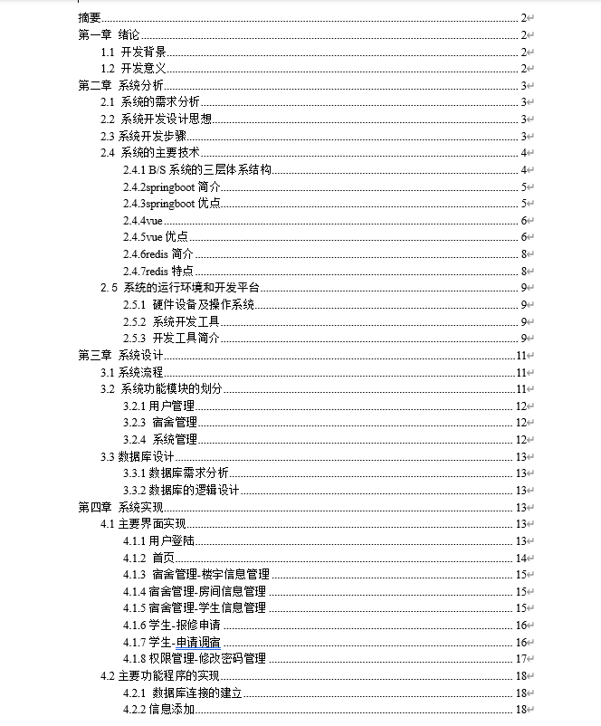

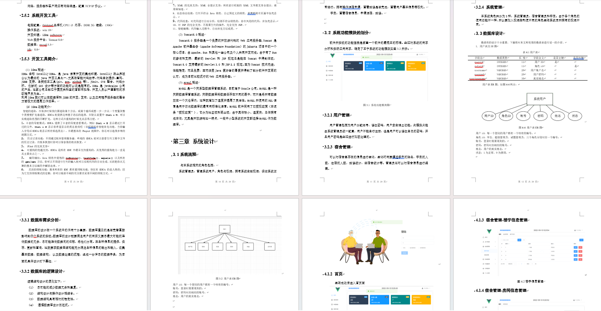

## 四、系统运行界面

### 1、前端

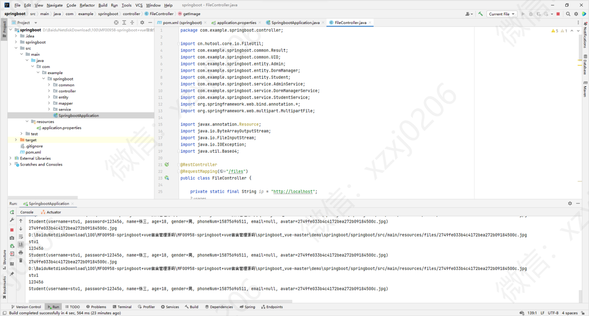

### 2、后端

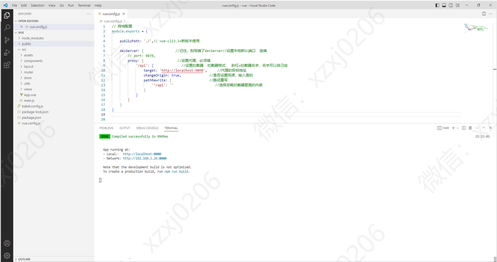

## 四、系统功能

### 1、系统管理员模块部分功能页面展示

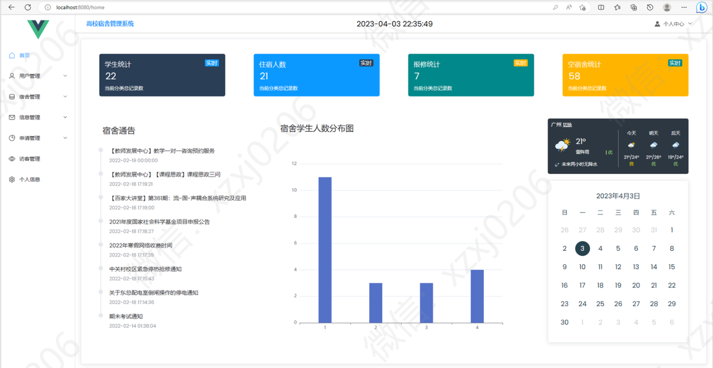

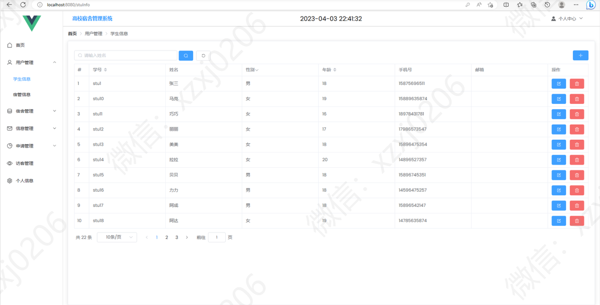

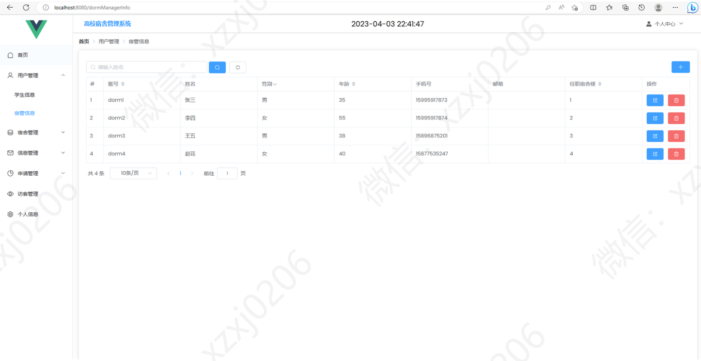

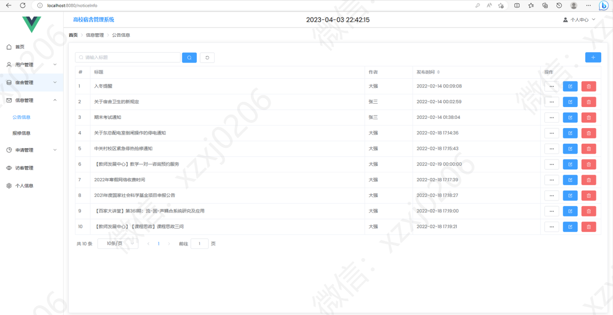

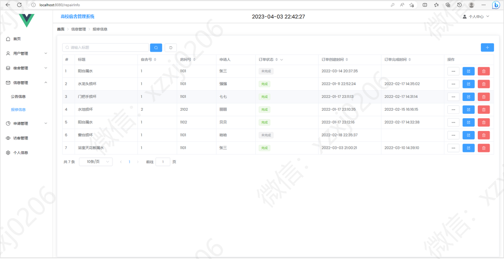

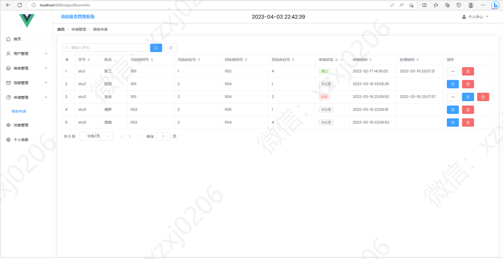

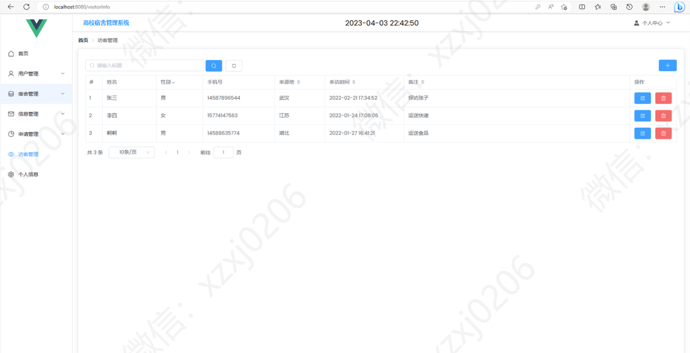

### 2、宿舍管理员模块部分功能页面展示

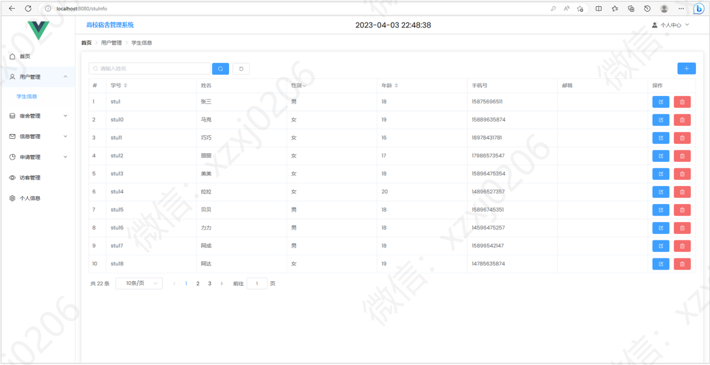

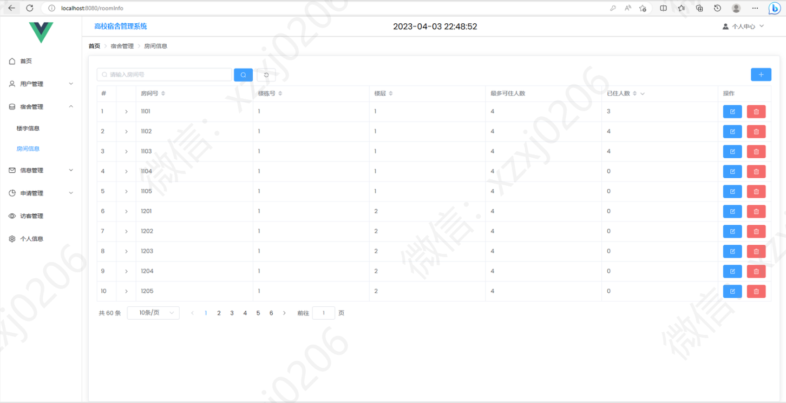

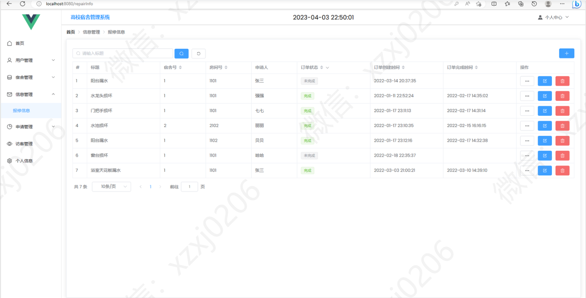

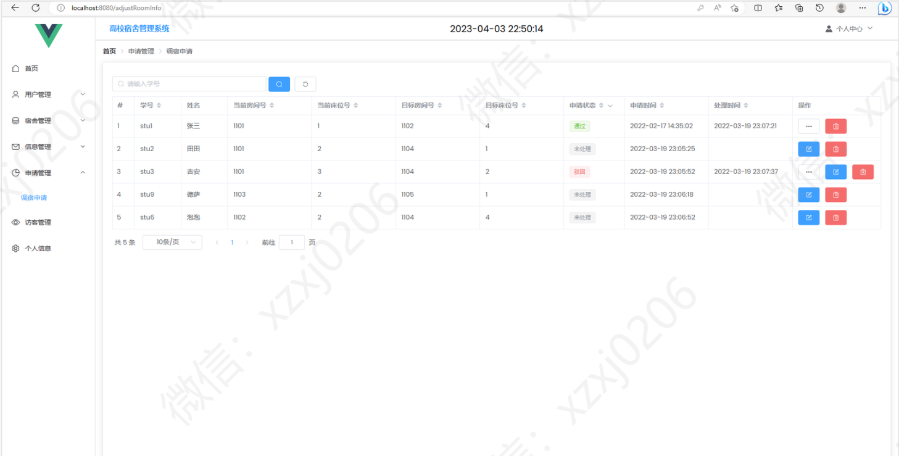

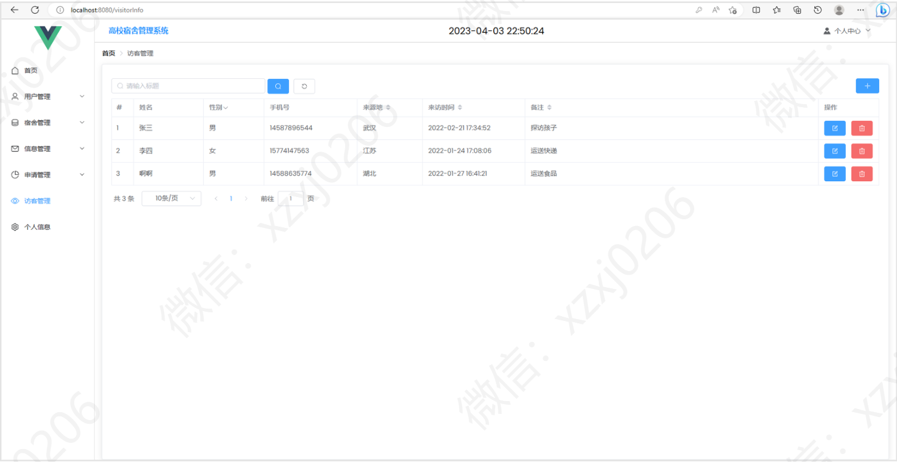

### 3、学生模块部分功能页面展示

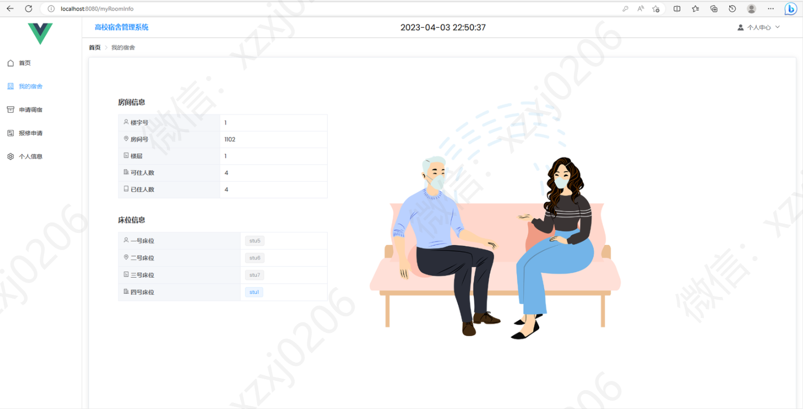

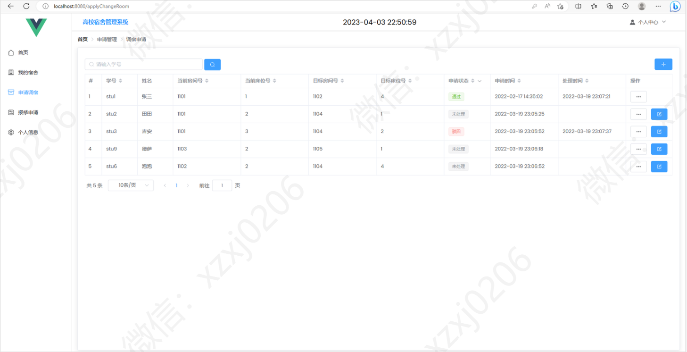

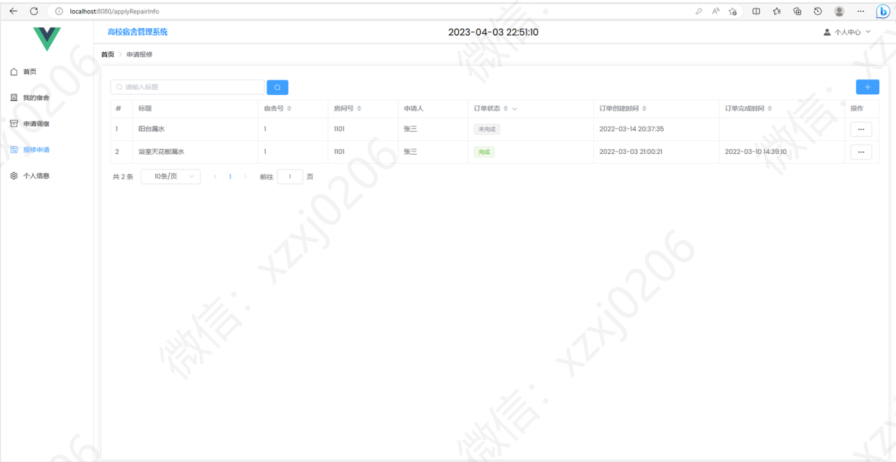

